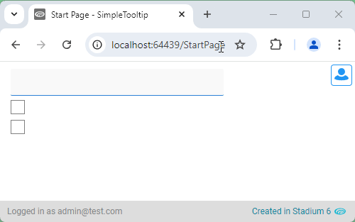

# Simple Tooltip <!-- omit in toc -->

Add simple text-only tooltips to controls



# Version
Initial 1.0

# Setup

## Application Setup
1. Check the *Enable Style Sheet* checkbox in the application properties

## Global Script
1. Create a Global Script called "SimpleTooltip"
2. Add the input parameters below to the Global Script
   1. Content
   2. ClassName
3. Drag a *JavaScript* action into the script
4. Add the Javascript below into the JavaScript code property
```javascript
/* Stadium Script v1.0 https://github.com/stadium-software/simple-tooltip */
let txt = ~.Parameters.Input.Content;
let className = ~.Parameters.Input.ClassName;
let attachToEl = document.querySelectorAll("." + className);
for (let i=0; i<attachToEl.length; i++) { 
    attachToEl[i].setAttribute("title", txt);
}
```

## Page
1. Add any control
2. Add a class to the control *Classes* property

## Page.Load
1. Drag the "SimpleTooltip" script to the event handler and complete the input parameters
   1. Content: The text you wish to show in the tooltip
   2. ClassName: The class of the elements where the tooltip must be shown

## Working with Stadium Repos
Stadium Repos are not static. They change as additional features are added and bugs are fixed. Using the right method to work with Stadium Repos allows for upgrading them in a controlled manner. How to use and update application repos is described here 

[Working with Stadium Repos](https://github.com/stadium-software/samples-upgrading)